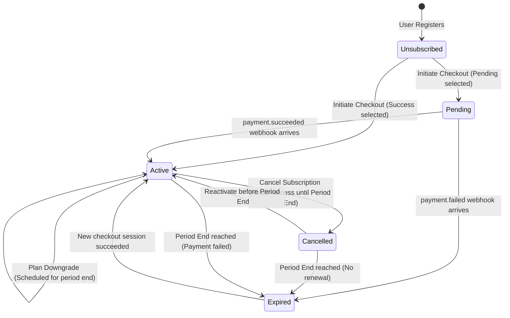

# System Architecture & Technical Design Decisions

This document details the architectural choices, database schema, state machine transitions, pro-ration formulas, and webhook idempotency design implemented in the **Subscription Billing Platform**.

---

## 1. Technical Stack Decisions & Rationale

*   **Next.js 15 (React 19 + TypeScript)**:
    *   *Why*: Next.js App Router unifies client-side user interfaces with server-side backend API Route Handlers. Writing backend logic directly in Next.js reduces the cost of maintaining separate client/server repositories, allows sharing data interfaces (TypeScript types) between frontend and APIs, and supports modern features like secure server-side session cookies.
*   **SQLite with Prisma ORM**:
    *   *Why*: The project guidelines recommend PostgreSQL, but allow alternative SQL engines with justification. SQLite is a zero-configuration, transactional, ACID-compliant relational SQL engine. Using SQLite combined with Prisma ORM ensures the database is completely embedded and runnable locally out of the box with `npm install` and `prisma db push`—meaning no external Postgres container or network connections are needed to evaluate the take-home project. All query structures are directly compatible and portable to PostgreSQL.
*   **JWT session cookies**:
    *   *Why*: Stored in secure, HTTP-only, SameSite cookies. Provides a robust, stateless method of authenticating users without session-database polling on every asset load, while remaining fully secure against Cross-Site Scripting (XSS) attacks.

---

## 2. Relational Database Schema

```mermaid
erDiagram
    User ||--o| Subscription : "has"
    User ||--o{ Invoice : "billed"
    User ||--o{ PaymentAttempt : "places"
    Subscription ||--o{ Invoice : "generates"

    User {
        string id PK
        string email UK
        string passwordHash
        datetime createdAt
    }
    Subscription {
        string id PK
        string userId FK "UK"
        string planId "basic | pro | enterprise"
        string status "active | cancelled | expired | pending"
        float price
        datetime currentPeriodStart
        datetime currentPeriodEnd
        boolean cancelAtPeriodEnd
        string pendingDowngradePlanId
    }
    Invoice {
        string id PK
        string invoiceNumber UK "INV-2026-XXXX"
        string userId FK
        string subscriptionId FK
        float amount
        string status "paid | unpaid | failed"
        datetime billingDate
    }
    PaymentAttempt {
        string id PK
        string userId FK
        string planId
        float amount
        string status "successful | pending | failed"
        string provider "mock | stripe"
        string providerPaymentId UK
        datetime createdAt
    }
    WebhookEvent {
        string id PK "evt_id"
        string status "processing | processed | failed"
        string error
        datetime processedAt
    }
    EmailLog {
        string id PK
        string to
        string subject
        string body
        string type "subscription_confirmed | invoice_generated | ..."
        datetime createdAt
    }
```



---

## 3. Subscription Lifecycle State Machine

A subscription transitions through the following states:



*   **Pending**: Subscription record is created, but features are locked. The system waits for bank clearance.
*   **Active**: Full tier features unlocked.
*   **Cancelled**: User requested termination. Access is maintained until `currentPeriodEnd`.
*   **Expired**: Access revoked. Subscription is terminated.

---

## 4. Webhook Idempotency & Concurrency Design

To handle payment gateway webhooks safely under network failure retries and high-concurrency duplicates, we implement a **Double-Gate Idempotency Guard**:

```
Webhook Request (Event ID: evt_101)
     │
     ▼
┌──────────────┐
│  Gate 1: DB  │  Try: INSERT INTO WebhookEvent (id="evt_101", status="processing")
│  Unique Key  │
└──────┬───────┘
       │
       ├──► [Key Exists] ──► Query status ──► [processed] ──► Return 200 OK (Instant Skip)
       │                                  └──► [processing] ─► Return 409 Conflict (Lock Retry)
       ▼
   [New Event]
┌──────────────┐
│    Gate 2:   │  Execute updating subscription, creating invoice, logging emails
│  Transaction │  under atomic DB isolation levels (prisma.$transaction)
└──────┬───────┘
       │
       ├──► [Success] ──► Update status = "processed" ──► Return 200 OK
       │
       └──► [Failure] ──► Rollback DB & update status = "failed" ──► Return 500 Error
```

### Key Technical Merits:
1.  **Unique Constraint Locking**: The `WebhookEvent` table uses the payment gateway's unique event ID (`id`) as its primary key. Attempting to insert a duplicate event ID throws a unique constraint violation database error (`P2002` in Prisma), preventing concurrent threads from entering the processing gate.
2.  **Concurrency Block (409 Conflict)**: If an event has status `processing`, it indicates another request thread is currently executing it. The system responds with an HTTP `409 Conflict`, telling the gateway client to wait and retry later.
3.  **Atomic Rollback**: Business operations (such as credit calculation, invoice generation, subscription period extensions) are enclosed inside a database transaction block. If any step fails, the entire transaction rolls back, leaving no half-applied states.

---

## 5. Plan Adjustments (Upgrade & Downgrade)

### Plan Upgrades (Immediate with Pro-ration Credit)
When a user upgrades their plan immediately, we credit them for the unused days on their previous plan and start a new 30-day billing cycle:

$$\text{Remaining Time Fraction} = \frac{\text{currentPeriodEnd} - \text{currentTime}}{\text{currentPeriodEnd} - \text{currentPeriodStart}}$$

$$\text{Unused Credit} = \text{Remaining Time Fraction} \times \text{Old Plan Price}$$

$$\text{Charge Amount} = \max(0, \text{New Plan Price} - \text{Unused Credit})$$

*Example*:
*   A user has a Basic plan ($9.00/mo) and is exactly halfway (15 days remaining) through their billing period.
*   Unused Credit = $0.5 \times \$9.00 = \$4.50$.
*   They upgrade to the Pro plan ($29.00/mo).
*   Pro-rated Upgrade Charge = $\$29.00 - \$4.50 = \$24.50$.
*   Their billing cycle starts anew today, and an invoice for **$24.50** is generated and marked as paid.

### Plan Downgrades (Deferred Execution)
Downgrades are deferred to protect consumer rights (preventing immediate loss of services paid for):
1.  The user's active plan remains the higher tier.
2.  The subscription field `pendingDowngradePlanId` is updated to the selected lower plan.
3.  At the end of the current billing cycle (`currentPeriodEnd`), a cron job or next payment webhook check will process the transition, updating the subscription plan to the lower tier and charging the lower rate moving forward.
